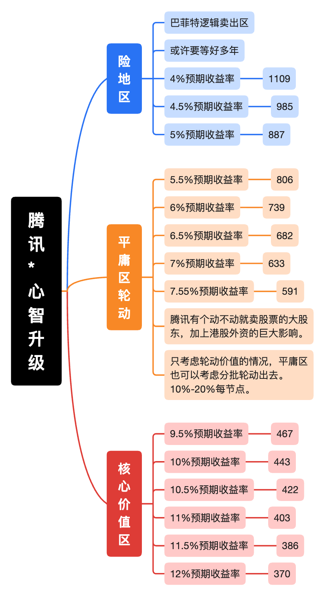

# 腾讯控股



## 护城河

| 护城河来源                 | 强度  | 说明                                                                                                       |
| -------------------------- | ----- | ---------------------------------------------------------------------------------------------------------- |
| 无形资产（品牌/专利/配方） | ★★★★★ | 微信/QQ是中文互联网最强大社交基础设施；王者荣耀、和平精英等IP壁垒极高；混元大模型技术能力跻身行业前列      |
| 转换成本                   | ★★★★★ | 微信14.18亿月活形成极强的社交关系链锁定，企业微信+小程序+微信支付构建B端生态粘性                           |
| 网络效应                   | ★★★★★ | 微信生态正反馈效应：更多用户→更多商家入驻小程序/微信小店→更多交易→更多广告→更多开发者→更强生态             |
| 成本优势                   | ★★★★☆ | 自研游戏占比提升拉高毛利率（2025年增值服务毛利率60%）；云服务规模效应显现；AI赋能降低内容制作/广告优化成本 |
| 规模/渠道优势              | ★★★★★ | 全球最大游戏公司，资本开支2025年达792亿元（创历史新高），AI基础设施投入能力远超竞争对手                    |

**护城河综合评估**：极宽极深。核心护城河来源于微信的社交网络效应（几乎不可复制），叠加游戏IP和全球化布局，构成三重壁垒。AI时代，腾讯凭借资金实力（年FCF超1,800亿）和场景覆盖（社交+内容+办公+云），具备构建AI生态的独特优势。

### 补充：波特五力与互补者生态

- **行业内竞争**：中等。游戏领域网易、米哈游争夺激烈；广告领域字节跳动增长迅猛（28% vs 腾讯约20%）。
- **潜在进入者威胁**：低。微信社交关系链的迁移成本近乎无穷大，历史上所有挑战者（飞信、子弹短信等）均未成功。
- **替代品威胁**：中等偏高。短视频（抖音）争夺用户时长；AI时代可能出现系统级AI Agent，绕过APP直接提供服务，构成对“超级APP”逻辑的潜在颠覆。
- **供应商议价能力**：低。游戏CP、内容创作者、广告主均高度依赖腾讯生态的流量分发能力。
- **买家议价能力**：低。14亿用户高度分散，单个广告主或游戏CP难以构成威胁。
- **互补者生态**：腾讯通过战略投资构建庞大的生态防御纵深，被投企业（美团、京东、拼多多等）与微信生态相互赋能，形成独特的“联邦式”商业模式，这是传统五力模型之外的重要护城河补充。

### 护城河面临的结构性挑战

- **AI时代的入口转移风险**：字节跳动火山引擎的豆包大模型日均消耗30万亿Token，在中文语境下已形成数据飞轮效应；若未来用户通过AI Agent而非主动打开APP获取服务，微信的“入口”优势可能被侵蚀。
- **游戏护城河的长期焦虑**：国内游戏用户规模见顶，长青IP面临年龄老化和娱乐形式分流的双重压力，新爆款产出不确定性较大。

## 竞争策略与增长飞轮

**核心增长逻辑**：

- **飞轮一（微信广告）**：微信用户增长→视频号/搜一搜内容消费增加→广告库存扩大→AI精准定向提升ROI→广告主预算增加→广告收入增长→更强内容生态投入→用户粘性提升
- **飞轮二（游戏全球化）**：自研/发行能力→高品质游戏→全球收入增长→更多研发投入→更强IP矩阵→更大市场份额
- **飞轮三（AI赋能）**：AI基础设施投入→混元大模型能力提升→赋能广告/游戏/云/办公→各业务毛利率提升→利润增长→更大AI投入

**业务梯队分类**：

| 阶段           | 业务                                                                          | 依据                             |
| -------------- | ----------------------------------------------------------------------------- | -------------------------------- |
| **已验证业务** | 本土游戏（年收入1,642亿，+18%）、微信广告（+19%）、金融支付                   | 持续增长，毛利高，现金流强劲     |
| **在验证业务** | 视频号电商/广告（2026Q1广告+20%加速）、国际游戏（+33%）、腾讯云（规模化盈利） | 增速超预期，AI驱动逻辑逐步兑现   |
| **储备业务**   | 混元大模型/AI Agent（微信AI智能体H2 2026落地）、AI原生应用（元宝/QClaw）      | 技术储备充足，商业化路径正在形成 |

### 云服务与AI竞争策略

- **腾讯云的战略选择**：主动放弃低质量转售业务，坚定走“自研产品、被集成”路线，2025年实现全年规模化盈利。差异化优势在于微信生态的连接能力——腾讯会议、企业微信、小程序云开发与14亿用户无缝对接。
- **AI云增量市场挑战**：火山引擎凭借豆包大模型，在MaaS层Token调用量上取得接近50%的市占率，形成断层领先；阿里云在传统IaaS市场仍以32.8%的份额稳居第一。腾讯云在AI云赛道尚无绝对优势，但凭借企业级AI Agent和微信智能体场景，有弯道追赶的可能。
- **资本投入对比**：字节2025年资本开支超1,600亿元（其中约900亿投向AI），是腾讯的约2.5倍；但腾讯AI投入已初步验证ROI（AIM+使广告主操作下降80%，部分广告点击率从0.1%升至3.0%），后续投入有清晰回报路径。

## SWOT分析

| 维度         | 要点                                                                                                                                                                                                                                                                |
| ------------ | ------------------------------------------------------------------------------------------------------------------------------------------------------------------------------------------------------------------------------------------------------------------- |
| **S (优势)** | ① 微信14.18亿月活构成不可复制的流量底盘；② 全球最大游戏公司，本土+海外双引擎；③ 年FCF超1,800亿元，资金储备充裕，AI投入无融资压力；④ 多元化收入结构（游戏49%/金科30%/广告19%），抗周期能力强                                                                         |
| **W (劣势)** | ① 体量巨大，增速中枢逐步下移（收入CAGR约10%）；② QQ年轻用户持续流失（月活同比-3%）；③ 国际游戏仍以并购/代理为主，自研全球化IP偏少；④ 组织复杂度随规模大幅提升（近12万员工），内部创新效率有待观察                                                                   |
| **O (机会)** | ① 视频号广告加载率提升空间大（当前3-4% vs 抖音12-14%）；② AI赋能全业务线提效降本+创造增量收入（AI Agent、AI云服务）；③ 微信小店电商GMV高速增长，闭环交易生态初具规模；④ 国际游戏从代理向自研升级，海外毛利率仍有提升空间                                            |
| **T (威胁)** | ① 中美科技博弈升级可能影响海外业务扩张及供应链（GPU）；② 短视频平台（抖音/快手）对用户时长及广告预算的持续争夺；③ 国内游戏行业监管政策反复风险；④ 经济下行周期或致广告主预算收缩；⑤ AI时代入口逻辑演变风险：系统级AI Agent可能绕过APP生态，动摇微信的“超级入口”地位 |

### 针对字节跳动威胁的专项评估

- **广告预算争夺**：字节跳动占据中国互联网广告26.7%的份额，增速约28%，腾讯份额约12%，增速约20%，差距正在收窄但压力犹存。
- **用户时长迁移**：字节系应用时长占比已达37.4%，对微信非聊天流量（朋友圈、公众号）的商业价值形成挤压。
- **AI军备竞赛**：字节资本开支规模是腾讯的约2.5倍，豆包大模型在开发者生态和Token调用量上暂时领先；但腾讯AI已在自有业务中验证ROI，竞争仍有悬念。
- **社交护城河的底线防御**：目前微信社交关系链仍是字节无法攻破的壁垒，多次社交尝试均告失败，短期内核心阵地稳固。

## 关键历史拐点与治理分析

- **2018年**：游戏版号暂停审批，腾讯游戏收入增速骤降，股价大幅回调。公司加速推进产业互联网战略（"930变革"），云业务开始规模布局。
- **2021年**：反垄断监管风暴+未成年人游戏防沉迷新规，腾讯全年净利润同比下降16%。公司主动减持京东、美团等被投企业股权，开启"瘦身"模式。
- **2022-2023年**：利润触底（2022年净利同比-39%，2023年ROE降至14.95%），公司降本增效，削减低ROI业务。同期，字节抖音电商与广告高速增长，对腾讯的威胁从潜在变为现实，促使腾讯加速视频号商业化。
- **2024-2025年**：业绩强劲复苏。毛利率持续提升（43%→48%→53%→56%），游戏版号常态化+国际游戏高增长+视频号广告放量。全年回购800亿港元并注销，积极回馈股东。同时，腾讯启动AI大规模投入，应对字节及阿里在AI云领域的挑战。
- **治理评价**：马化腾领导的管理团队战略执行力强，在监管压力下成功完成业务转型与降本增效，从"规模扩张"转向"高质量增长+股东回报"双轨模式。近年来回购+分红力度显著加大，治理层面整体评价优良。

## 核心风险清单

| 风险类别                   | 可能性 | 影响 | 说明                                                                                                                                                                           | 跟踪指标                                                     |
| -------------------------- | ------ | ---- | ------------------------------------------------------------------------------------------------------------------------------------------------------------------------------ | ------------------------------------------------------------ |
| **AI投入回报不达预期**     | 中     | 高   | 未来3年CAPEX超3,000亿，若AI商业转化滞后，将拖累FCF增速                                                                                                                         | CapEx/收入比、AI产品用户数及变现进展、广告毛利率             |
| **中美地缘政治/GPU供应**   | 中高   | 高   | 美国可能进一步收紧高端GPU出口管制，影响AI算力扩张节奏                                                                                                                          | 出口管制政策变化、公司GPU库存/替代方案进展                   |
| **宏观经济疲软影响广告**   | 低中   | 中   | 若经济大幅下滑，广告主预算缩减，但微信闭环广告韧性相对较强                                                                                                                     | 广告收入增速、广告主行业分布变化                             |
| **游戏监管政策反复**       | 低     | 中   | 当前版号常态化，但不排除未来监管趋严的可能性                                                                                                                                   | 国产/进口版号发放节奏、未成年人保护新规                      |
| **微信流量红利见顶**       | 低     | 中   | 月活增速仅+2%，增长依赖ARPU提升而非用户扩张；视频号广告加载率有天花板                                                                                                          | 微信月活、视频号使用时长增速、广告加载率                     |
| **投资组合减值风险**       | 低中   | 低中 | 持有大量非上市公司股权，宏观下行或致公允价值缩水                                                                                                                               | 联营/合营公司盈亏、投资公允价值变动                          |
| **字节跳动广告及用户竞争** | 中高   | 中高 | 字节占据广告市场26.7%且增速较快，用户时长持续向字节系迁移，对腾讯广告和内容生态形成持续压力                                                                                    | 腾讯广告收入增速、视频号时长占比、用户时长格局变化           |
| **AI时代入口迁移风险**     | 中     | 高   | 若系统级AI Agent成为主流交互方式，用户绕过微信直接获取服务，可能动摇腾讯“超级APP”根基；字节火山引擎在MaaS Token调用量份额近50%，阿里在AI云总量领先，腾讯在AI入口层尚无绝对优势 | 元宝及微信AI智能体用户数、混元大模型调用量、AI云市场份额变化 |
| **游戏护城河结构性削弱**   | 低中   | 中   | 国内用户触顶，长青IP老化风险，新爆款成功率低，海外自研IP储备仍显不足                                                                                                           | 国内游戏收入增速、新游上线表现、海外自研游戏收入占比         |

## SWOT分析

| 维度         | 要点                                                                                                                                                                                                                     |
| ------------ | ------------------------------------------------------------------------------------------------------------------------------------------------------------------------------------------------------------------------ |
| **S (优势)** | ① 微信14.18亿月活构成不可复制的流量底盘；② 全球最大游戏公司，本土+海外双引擎；③ 年FCF超1,800亿元，资金储备充裕，AI投入无融资压力；④ 多元化收入结构（游戏49%/金科30%/广告19%），抗周期能力强                              |
| **W (劣势)** | ① 体量巨大，增速中枢逐步下移（收入CAGR约10%）；② QQ年轻用户持续流失（月活同比-3%）；③ 国际游戏仍以并购/代理为主，自研全球化IP偏少；④ 组织复杂度随规模大幅提升（近12万员工），内部创新效率有待观察                        |
| **O (机会)** | ① 视频号广告加载率提升空间大（当前3-4% vs 抖音12-14%）；② AI赋能全业务线提效降本+创造增量收入（AI Agent、AI云服务）；③ 微信小店电商GMV高速增长，闭环交易生态初具规模；④ 国际游戏从代理向自研升级，海外毛利率仍有提升空间 |
| **T (威胁)** | ① 中美科技博弈升级可能影响海外业务扩张及供应链（GPU）；② 短视频平台（抖音/快手）对用户时长及广告预算的持续争夺；③ 国内游戏行业监管政策反复风险；④ 经济下行周期或致广告主预算收缩                                         |

## 关键历史拐点与治理分析

- **2018年**：游戏版号暂停审批，腾讯游戏收入增速骤降，股价大幅回调。公司加速推进产业互联网战略（"930变革"），云业务开始规模布局。
- **2021年**：反垄断监管风暴+未成年人游戏防沉迷新规，腾讯全年净利润同比下降16%。公司主动减持京东、美团等被投企业股权，开启"瘦身"模式。
- **2022-2023年**：利润触底（2022年净利同比-39%，2023年ROE降至14.95%），公司降本增效，削减低ROI业务。
- **2024-2025年**：业绩强劲复苏。毛利率持续提升（43%→48%→53%→56%），游戏版号常态化+国际游戏高增长+视频号广告放量。全年回购800亿港元并注销，积极回馈股东。
- **治理评价**：马化腾领导的管理团队战略执行力强，在监管压力下成功完成业务转型与降本增效，从"规模扩张"转向"高质量增长+股东回报"双轨模式。近年来回购+分红力度显著加大，治理层面整体评价优良。

## 核心风险清单

| 风险类别                 | 可能性 | 影响 | 跟踪指标                                                              |                                                  |
| ------------------------ | ------ | ---- | --------------------------------------------------------------------- | ------------------------------------------------ |
| **AI投入回报不达预期**   | 中     | 高   | 未来3年CAPEX超3,000亿，若AI商业转化滞后，将拖累FCF增速                | CapEx/收入比、AI产品用户数及变现进展、广告毛利率 |
| **中美地缘政治/GPU供应** | 中高   | 高   | 美国可能进一步收紧高端GPU出口管制，影响AI算力扩张节奏                 | 出口管制政策变化、公司GPU库存/替代方案进展       |
| **宏观经济疲软影响广告** | 低中   | 中   | 若经济大幅下滑，广告主预算缩减，但微信闭环广告韧性相对较强            | 广告收入增速、广告主行业分布变化                 |
| **游戏监管政策反复**     | 低     | 中   | 当前版号常态化，但不排除未来监管趋严的可能性                          | 国产/进口版号发放节奏、未成年人保护新规          |
| **微信流量红利见顶**     | 低     | 中   | 月活增速仅+2%，增长依赖ARPU提升而非用户扩张；视频号广告加载率有天花板 | 微信月活、视频号使用时长增速、广告加载率         |
| **投资组合减值风险**     | 低中   | 低中 | 持有大量非上市公司股权，宏观下行或致公允价值缩水                      | 联营/合营公司盈亏、投资公允价值变动              |

## 过往业绩何以优秀

"飞轮效应"的完美演绎

```text
微信社交护城河（14亿月活）
    ↓
海量流量几乎零成本获客
    ↓
多元变现场景（游戏+广告+支付+云）
    ↓
持续正反馈（AI优化广告投放→更高点击率→更多广告主投放→更多数据优化模型）
    ↓
现金流→反哺：回购增厚价值 + 大举投入AI（706亿研发/180亿AI新产品投入）
    ↓
飞轮继续加速
```

### 关键证据链

1. **毛利率提升的"结构性"本质**：从43%→56%不是偶然——背后是AI降低了广告精准投放的边际成本、游戏自研能力提升降低了分成成本、云业务从烧钱到盈利的质变。每一环节的提升都具有可持续性，而非一次性事件。

2. **"克制"背后的战略远见**：腾讯对AI"不急于All in"的策略并非战略犹豫——资本投入的前提是"确定性"——先用AI赋能现有业务验证ROI，确认回报路径后再加大投入，这是典型的"腾讯式打法"。

3. **ROE的可持续性**：2025年ROE回升至21.13%是在**权益乘数（杠杆率）持续下降**的背景下实现的，驱动因子是利润率的改善而非加杠杆，因此ROE的"质量"显著高于2021年依赖高杠杆的29.77%时期。

4. **AI赋能的多点验证**：广告（AIM+使广告主操作下降80%，点击率从0.1%→3.0%）、游戏开发（人效提升超75%）、云服务（首次全年盈利）——AI不是"PPT概念"，而是已有实际回报数据支撑的增长引擎。

### 风险因素对"持续优秀"的挑战

上述分析也揭示了"持续优秀"面临的关键挑战：

- 2026年Q1增速降至约9%，部分增长动力正在减弱；
- 字节跳动高速扩张正在蚕食广告和内容市场份额；
- AI时代的"入口迁移"风险尚未被充分定价。

## 文章推荐

[腾讯AI悲观预期过度，社交护城河构筑坚实底部（2026.02.21 昆仑侠）](https://mp.weixin.qq.com/s/SvfZjcwyEFFCZn_txJAk3w)

- AI赛道远未到一家独大的终局，垄断格局难以形成
- 腾讯的社交护城河，仍是难以撼动的核心壁垒
- 腾讯与苹果同为产品生态型公司
- AI并非腾讯的威胁，反而是全业务线的增长助推器

[腾讯绩后交流思考：混元实用场景并不差，鹅是干事型而非叙事型公司（2026.05.15 卓哥的投研笔记）](https://mp.weixin.qq.com/s/X7v-6yLcbDUTEoGP-ynTqg?scene=1)

- 核心结论：市场担忧过度，当前是机会
  - 市场因腾讯AI暂时落后而悲观，但文章认为这放大了短期波动，低估了其社交护城河。当前估值接近历史低位，安全边际高。
- AI格局未定，腾讯模式可参考苹果
  - 大模型赛道不会一家独大，未来是多强并存。腾讯与苹果类似，核心优势是产品与生态（微信），而非必须拥有最强技术。苹果Siri拉胯也未伤及根本，且正通过合作（谷歌）补齐短板。
- 社交壁垒难以撼动
  - 微信基于14亿人的社交关系链几乎无法迁移。AI无法替代人与人的情感交流，反而使真实社交更珍贵。视频号、腾讯会议已证明，不撼动社交壁垒，腾讯就能后来居上。
- AI是腾讯业务的“助推器”，而非“威胁”
  - 游戏、广告、云等核心业务均受益于AI。游戏地位稳固，AIGC降本增效；广告因AI推荐增收；云业务借AI需求实现盈利。
  - 腾讯认为，AI跟互联网的本质区别是，互联网服务的边际成本极低，AI每多服务一个用户，都会产生算力成本。腾讯不会只追求做大DAU的产品（意味着成本高），而是要找到高价值的使用场景。
- 与DeepSeek的深度绑定存在想象空间
  - 腾讯是唯一仍与DeepSeek深度合作的巨头，未来有潜力复制“苹果+谷歌”模式，投资或合资弥补基础模型短板。

[腾讯AI的生态位重估（2026.06.28 第25号宇宙）](https://mp.weixin.qq.com/s/k4QEaIjECb26ryNBDQnkpQ)

全文主旨：AI时代模型能力趋于收敛，竞争核心从技术追赶转向生态与分发，腾讯凭借社交关系、支付闭环和小程序网络等不可复制的稀缺资产，处于生态位重估的优势位置。

**模型收敛终局**：当通用智能变成够用且便宜的基础设施，比拼的不再是谁的模型更强，而是谁能把AI嵌入最丰富的场景和商业闭环。
**“终结者”逻辑**：先发优势不决定终局，最后做出关键突破并建立极高护城河的玩家才是赢家。
**人才与知识扩散**：预训练技术范式固化，开源生态和人才流动将隐性经验转化为行业公共资产，通用基座差距持续收窄。
**够用阈值**：对绝大多数场景，模型能力从80分提到95分的体验增益极小，但成本指数上升，极致性价比路线商业价值更大。
**竞争重心后移**：后训练对齐、Agent强化学习、场景深度协同正在取代基座性能，成为拉开产品体验差距的主战场。
**腾讯追赶路径**：借力开源模型补齐编程等短板，自研聚焦社交、办公、游戏等独有生态的场景适配，投入产出比更高。
**AI Infra即迭代效率**：把假设到实验的闭环从数周压到数天，修bug越多模型越好，核心是兼具科研认知与工程落地能力的复合型人才。
**组织症结与修正**：BG自治导致资源分散、目标割裂；2025年底架构重组，将混元实体化、成立AI Infra部，让一线技术专家统领决策。
**信任壁垒**：十亿级实名社交图谱在生成式内容泛滥时代成为稀缺的信任过滤器，社交推荐的价值被AI进一步放大。
**执行与结算闭环**：支付串联身份资金商户，数百万小程序构成现成服务网络，构成Agent时代从生成答案到交付结果的天然护城河。
**广告双引擎**：AI提效推高eCPM和转化率，视频号加载率仅5.1%，距行业成熟水平仍有数倍爬坡空间。
**游戏长青化**：AI全链路降本提效，拉长头部产品生命周期，推动业务从爆款脉冲型转向稳态服务型，现金流质量提升。
**路径依赖护城河**：字节的公域分发基因、阿里的交易平台基因，都锁死了它们复刻腾讯私域社交闭环的能力。
**入口防御战**：微信“小微”AI助手守住意图第一分发权，Marvis助手卡位系统级入口，防止流量被操作系统级AI重新中介化。
**A2A双刃剑**：向系统开放功能接口可扩大触达，但也可能让系统AI绕过微信直接承接需求，存在被架空风险。
**C端证伪B端务实**：通用AI助手尚未带来颠覆性体验突破，腾讯的AI增量更确定地来自广告、游戏、云等存量业务效率提升。
**估值极低预期**：核心业务静态PE仅约10倍，隐含永续增速接近零，市场已完全按零增长的现金牛定价。
**三重下行保护**：估值底已充分计价悲观预期；约6100亿高流动性上市股权构成资产底；广告游戏金融等盈利底支撑注销式回购。
**可量化上行期权**：AI驱动的广告量价齐升、游戏利润率改善、Agent导购与支付手续费新增量，均来自现有业务深化，确定性高。

## 杂谈

### 估值

曾被给予很大高增长希望的云计算业务很大部分实际是在三大营运商

合理估值PE=8.5+（1~1.5）×15=23.5~31

2022年腾讯非国际会计准则利润大数按1200亿人民币考虑，则合理估值为28200~37200亿人民币，加腾讯的投资资产，原来是1万亿左右，估值也一直在波动，京东和美团分红后，现在粗估就按7000亿人民币左右吧，合计合理估值大概为3.5~4.4万亿人民币，按最近汇率0.86考虑，折成港元大约是4.1~5.1万亿。

加仓开始点位控制在合理估值范围的7折左右，也就是2.9~3.6亿港元，取平均值3.25万亿港元，也就是股价339港元左右以下，越跌越加，股价400（3.83万亿港元）~550港元（5.27万亿港元）左右区间主要为少量网格式交易卖出，超过550港元则开始以较大幅度减仓，越涨越减，当然这个加减仓的绝对价位也就是在2023年采用，以后每年都要调整。

腾讯值得拥有，长期稳定的高毛利率公司，自然垄断、高粘性、高频使用型业务，腾讯云往后也会很有钱途。华水、腾讯都可以配置一些。

港股这两年确实是那种系统性的大幅下跌，这种下跌作为投资者是没有太好的应对措施的。

（23.8）考虑到期权问题，对腾讯估值做出调整：基本上应该对原来估算的合理估值打八折。考虑到今年已经过了一大半，腾讯业绩也比上次估算是有所提高，今年非国际准则利润大概在1400亿左右，有百分之十几的提升，就简单按打九折进行修正。也就是说，今年提高仓位的价格标准由339HKD降为306HKD以下；原来股价400~550HKD左右的网格交易卖出卖出区间调整为356~496HKD左右，这样310~350HKD左右就成了网格交易的纯买入区间，纯减持价位由550HKD调整为500HKD以上开始。

—— 学知利行

### 缺乏爆发时增长潜力

25.12.31。腾讯在2025年不断随上涨减持和波段回补中逐渐降低仓位，并最终在650元左右清仓，腾讯是个不错的公司，但我理解，它后期业绩缺乏爆发式增长的潜力，但它股价如果跌到估值有一定吸引力，我也愿意再次建仓一定仓位，核心在于公司优秀的质地、很好的确定性、以及充沛的现金流。

—— 学知利行
