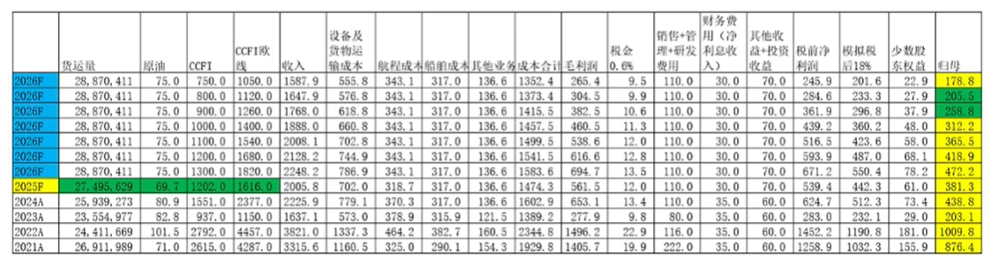

# 中远海控

## 综合信息

### 文章推荐

- [20251208 中远海控 谷底利润多少](https://www.bilibili.com/video/BV16f2yBCERo)
  - **利润因子：运价、油价**
  - CCFI 最低是 740，但实际最低平台是 800 左右，因此计算 800 对应的利润
  - **利润模型**：26 年 75 美元布油假设下 CCFI 800 对应利润 205，900 对应 258
  - 
  - 分析：运价底部，也有 200~250 利润，最差情况下，对应的 PE 是否低估？
    - 需考虑：
    - 1. 净利息收入贡献 30 亿利润
    - 2. 集运部门预期利润只有 100 亿体谅
    - 3. 如果油价从 70 涨到 100 ，将吞噬 100 亿利润
  - 观点：
    - 1. 现金储备构成抗风险的能力
    - 2. **绝不可以扣除现金，进行估值计算**；没分到你手里就不是你的，过度累积反而是一种低效的表现
    - 3. 要做好长期运价低迷的准备；**也就是长期 250 亿以下利润**
  - 估值：
    - 基于未来运价长期在 CCFI 800 ~ 850 判断未来利润体量为 200，分红率 50%+回购
    - 周期股 + 运价向下突破可能性，存在油价风险，基础估值 8PE，分红溢价 30%，给到 2080((200 \* 8) × 1.3)~2600
    - 基于长期运价低迷判断，没有周期股看涨期权价值，26 年股息率刚好 5%
  - 随便聊：
    - 由于公司净资产现金含量超过 50%，按照底线估值在 10PE 左右
    - 极端情况外，1PB 都有相当强支撑力
    - 依然**建议以估值回归的逻辑看待**
    - **不要低估周期底部的长度与突发情况**

### 跟踪指标

[萝卜投研](https://robo.datayes.com/v2/landing/indicator_library)数据搜索 SCFI 和 CCFI 查看运价指数
