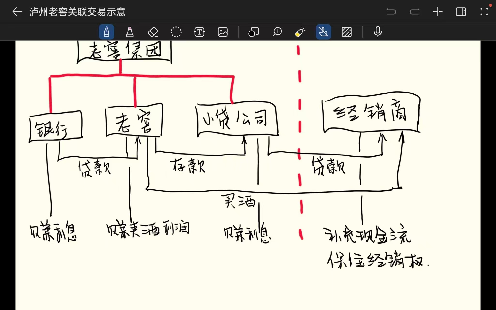

# 泸州老窖

## 综合信息

## 宁静的冬日M为何特别看好泸州老窖？——品牌动态性与投资逻辑解析

[追光002|——宁静的冬日M为何特别看好泸州老窖？——品牌动态性与投资逻辑解析（2025.11.27 巴芒大道）](https://mp.weixin.qq.com/s/N_W42hlMV5kH6IPE9jjBqA)

**全文主旨**：宁静的冬日M认为白酒品牌地位并非一成不变，他看好泸州老窖，因为其通过国窖1573成功重塑了高端品牌，并坚守稀缺性战略，走的是一条靠品质和时间价值复利发展的正确道路，而茅台当前的领先只是阶段性的。

**核心洞见**

- **品牌地位是动态的**：泸州老窖特曲曾是浓香第一，后来被五粮液超越，五粮液泛滥后又被茅台反超。品牌领先地位是经营的结果，不存在永恒的王者。
- **口碑的长期决定性**：核心饮酒群体的口碑是左右品牌未来销量的意见领袖，小看他们就会犯致命错误，马太效应只能管一时。
- **正确的道路是做品质而非求量**：高端烈酒正确的路是把品质做好，打造长期不倒的高端品牌，而非越做越大。当年泸州老窖从名酒变民酒，根本原因就是量放得太大。
- **国窖1573的战略核心是稀缺性**：管理层清晰传递了1573仅3000吨的产量边界，这是做高端酒的前提。要让人看得起，就必须维持稀缺性。
- **高端嗜好品能跑赢通胀**：长期来看，做得好且稀缺的名酒价格能跑赢通胀，这是白酒企业利润增长的核心驱动力，靠的不是扩大产能。
- **贴牌不是毁掉高端形象的元凶**：真正毁掉老窖高端形象的，是80年代的盲目扩张，而非低端贴牌。茅五也有贴牌，但其高端形象未受影响。
- **老窖管理层做对了两件大事**：一是将部分生产单元改制，精简人员；二是花费十年时间重塑了高端品牌国窖1573，为其未来奠定了基础。
- **投资回报来自分红复利和品牌时间价值**：即使股价不涨，通过长期高分红的再投资，也能获得惊人回报。企业的价值在于品牌在用户心中长期积累的过程。

**隐含推理**

- **茅台当前优势并非不可撼动**：从历史规律看，品牌会因战略失误而衰落。茅台目前更多在消耗历史遗产（如依赖季克良时代建立的品牌力），若缺乏真正的品牌创新，其地位未来也可能被动摇。
- **评判管理层要看其战略方向而非一时错误**：张良和谢明犯过错误，但他们重塑高端品牌和精简人员的战略决策，对老窖的长期影响远超短期错误。这隐含了评价管理层应关注其做的“对的事”的思维。
- **“不增长”的稀缺性战略反而是更高阶的增长**：市场看不起泸州老窖“上不起量”，但这恰恰是其为打造真正高端品牌所必须付出的代价。主动限制短期规模增长，是为了获取长期的品牌价值和定价权。
- **茅台的品牌模式存在内在脆弱性**：茅台的品牌力很大程度上依赖于独特的圈层营销和特定的社会生态，这种品牌投入方式是双刃剑。离开了这种生态，用户对品牌可能缺乏真正的情感，这为茅台的长远未来埋下了隐忧。
