# 行业研究

## 书籍推荐

- 《如何快速了解一个行业》

## 如何快速了解一个行业笔记

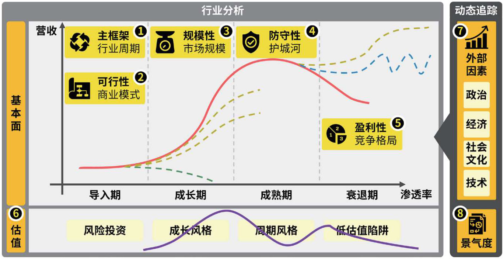

### 主框架：行业不同发展阶段的分析重点

创新扩散理论——《创新的扩散》

- 创新者：愿意大胆尝试新概念的人，比如国内首批特斯拉 Model S 车主。
- 早期采用者：往往是 KOL（Key Opinion Leader，关键意见领袖）或者 KOC（Key Opinion Customer，关键意见消费者）​。他们一般在圈子里拥有一定的影响力。比如紧跟首批车主入手了特斯拉 Model S，并第一时间在朋友圈、汽车之家等平台上分享体验的人。
- 早期大众：须经深思熟虑才接受新概念或购买创新产品，但愿意对新事物持开放心态的人。比如，在看了各种评测报告、亲自试驾，且充分了解了新能源汽车的各项性能和特点之后，从倾向购买 BBA（宝马、奔驰、奥迪）转向购买国产高端电动车的人。
- 后期大众：一般是顾虑比较多的人。他们出于社会压力或经济压力，接受新事物的时间点比较靠后。比如，一些顾客一开始会担心充电桩密度不够、冬天电池性能下降、续航里程“缩水”等问题，不愿意承担试错成本；一直等到身边很多朋友用亲身经历证明电动车的问题不大之后，才敢买入新能源汽车。
- 落后者：顾名思义，是指比较因循守旧、信息闭塞的人。或许只有等到燃油车在很多方面比不上新能源汽车了，这个群体才会考虑购买后者。

|          | 导入期                | 成长期                  | 成熟期              | 衰退期     |
| -------- | --------------------- | ----------------------- | ------------------- | ---------- |
| 新增用户 | 创新者                | 早期采用者 早期大众 | 后期大众            | 落后者     |
| 产品     | 不成熟                | 迭代中                  | 成熟 更加标准化 | 高度标准化 |
| 供求关系 | 产能很小 需求很小 | 供不应求                | 供求基本平衡        | 供过于求   |
| 毛利率   | 较高 可能打价格战 | 较高                    | 下降                | 很低       |
| 示例行业 | 人形机器人            | 新能源汽车              | 白色家电            | 实体唱片   |

---

- 准确定义行业并不容易，我们可以参考常见的行业分类标准。
  国家标准：​《国民经济行业分类》​；
  中国证监会：​《上市公司行业分类指引》​；
  市场常用：​《申万行业分类标准》​。
- 传统的产业生命周期理论缺乏实操性，本书在其基础上进行了改进。
  应当以渗透率作为划分产业生命周期不同阶段的标准：15%~ 20%和 35%~ 40%分别是区分导入期与成长期、成长期与成熟期的经验指标。
  产业生命周期的不同阶段有不同的分析重点：导入期的研究重点是商业模式的可行性，成长期的研究重点是市场规模（规模性）​，成熟期的研究重点是护城河（防守性）和竞争格局（盈利性）​，衰退期需要关注来自替代品的威胁。
- 除了基本面，我们还需要考虑产业生命周期不同阶段的估值倍数特点。
- 由于外部因素会持续变化，所以我们要用发展的眼光看待行业，持续对行业的景气度进行高频跟踪，以验证我们的分析成果。

### 可行性：既然知道会输，那为何要“下注”

#### 《商业模式新生代》商业模式画布

|          | 结构名称 | 含义                                       |
| -------- | -------- | ------------------------------------------ |
| 价值主张 | 价值主张 | 用于解决客户问题、满足客户需求             |
|          | 客户细分 | 企业所服务的一个或多个客户分类群体         |
|          | 客户关系 | 在每一个客户细分市场建立并维护客户关系     |
| 运营模式 | 关键业务 | 通过执行一些关键的业务活动，运转商业模式   |
|          | 核心资源 | 提供交付所必备的重要资产                   |
| 界面模式 | 渠道通路 | 通过沟通、分销和销售渠道向客户传递价值主张 |
|          | 重要合作 | 有些业务要外包，有些资源需要从企业外部获得 |
| 盈利模式 | 成本结构 | 商业模式中所有环节所引发的成本构成         |
|          | 收入来源 | 收入来源产生于成功地为客户提供了价值主张   |

如果觉得有其它重要的维度可以自行添加

---

- 商业模式体现的是生产力三要素（劳动者、劳动资料、劳动对象）和生产关系三要素（生产资料所有制形式、人们在生产中的地位及其相互关系、产品分配方式）的排列组合。
- 商业模式没有“标准答案”​，同一行业中的同一公司可能有多种可行的商业模式。
- 要验证商业模式，​（理论上）可以通过穷举的方式列出所有选项，再通过快消品企业常用的调研法，或风险投资机构常用的试错法进行验证。
- 对于处在导入期的行业，判断其商业模式是否可行是行业研究的重点。可以从销售可行性评估和利润可行性评估两个角度入手。
  销售可行性评估：通过时间对标法对标过去，看看有没有类似的需求存在；通过空间对标法对标成熟市场，看看有没有类似的成功案例。
  利润可行性评估：通过定性分析，从频次和弹性两个维度来评估收入，用标准化程度来评估成本；通过定量分析搭建 UE 模型，并进行动态追踪。
- 大部分创新可以划分成基础层创新、中间层创新、应用层创新。先有基础层创新，再有中间层创新，最后才轮到应用层创新。

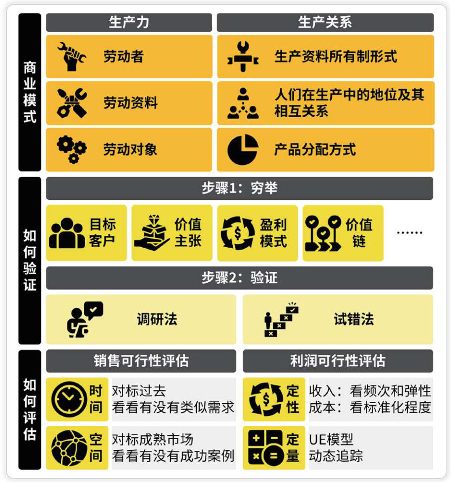

### 规模性：为什么有些公司上不了市

1. 假设我们正在考虑投资一家生猪养殖企业。在做出投资决策之前，我们必须搞清楚一个问题—中国一年总共会消费多少吨猪肉？
2. 假设我们计划在北京销售家用地毯。在开始做这个生意之前，我们必须搞清楚一个问题—北京家用地毯的市场规模是多少？
3. 假设我们计划在北京销售家用地毯，需要估算北京家用地毯的市场规模。已知目前的渗透率还未饱和：去年的渗透率为 40%，今年提升至 50%。
4. 假设我们正在考虑加盟蜜雪冰城，现在需要估算一家典型的蜜雪冰城店铺一年的销售额。
5. 香港有多少台自动取款机（ATM）​？
6. 我想了解某个县级市的金融行业从业者数量，但是在官方数据库、政府统计部门以及当地统计年鉴中都没有找到这个数据，那么我该如何测算当地的金融行业从业者数量？
7. 尝试估算中国住宅电梯的保有量。
8. 尝试估算中国 2050 年的生活用纸量。
9. 测算 2030 年中国现制茶饮（奶茶）的市场规模。

- 企业上市有营业收入等条件。如果行业规模过小，则存在着无法孕育出满足条件的企业的可能性。因此，在企业的成长期，我们需要格外关注市场规模。
- 新兴行业、规模太小的行业，往往缺乏现成的市场测算数据，这时就需要我们自行测算。此外，只有掌握市场测算的方法，才能更好地判断别人的测算是否靠谱。
- 市场规模主要有 3 种口径，分别是：
  潜在市场（TAM）​，即这个市场的潜在需求有多大；
  可服务市场（SAM）​，即现在有多少需求已经被满足了；
  可获得市场（SOM）​，即某家公司现在拿下了多少市场。
- 不同的市场规模测算方法适用于不同情形：
  需求导向的测算方法主要基于渗透率和替代率，更适合测算 TAM；
  供给导向的测算方法主要基于对供给侧瓶颈环节的分析，更适合测算 SOM；
  供需匹配的测算方法主要有“以小见大”和“以大见小”两种方式，更适合市场已经比较饱和、处于成熟期的行业，以及供给和需求之间存在稳定比例关系的行业。

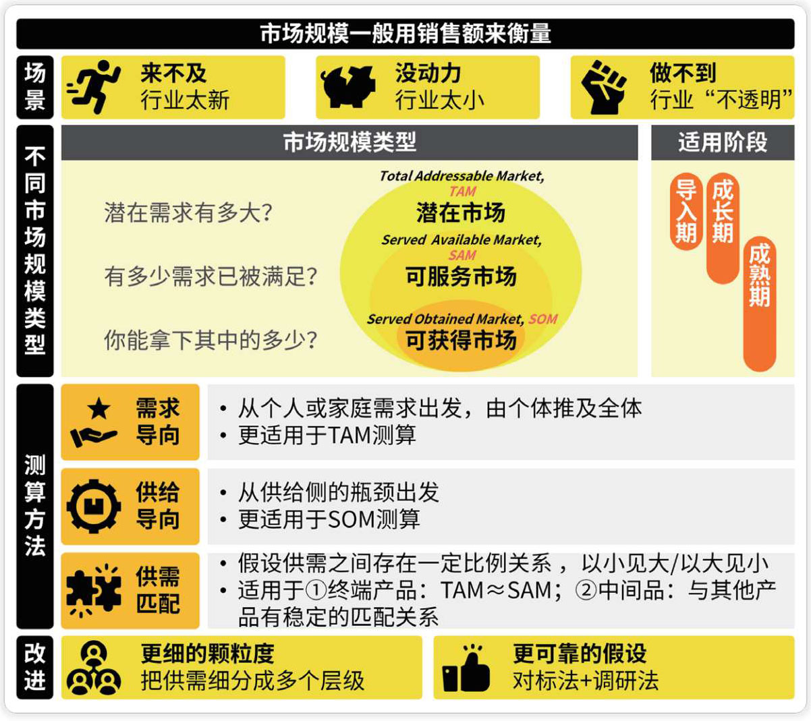

### 防守性：这个行业会被替代吗

企业维护客户关系的发力点：

- 决策：企业可以想方设法降低客户的决策成本
- 购买：企业可以竭尽所能降低客户的购买成本
- 使用：企业可以努力让客户的转换成本高于价值差

---

从整体看，转换成本主要来源于以下几个仿方面：

- 社交关系：如手机号、社交平台等；
- 用户习惯：如操作系统等；
- 学习成本：如生产力工具等；
- 数据沉淀：如云服务、笔记软件、音乐软件等；
- 会员体系：如高端会员制商店、信用卡、酒店、航空公司等；
- 长期合同：如 SaaS、电煤供应等；
- ……

一般来说，资产专用化程度越高、培训需求越大、转换适应时间越长、转换行为对用户的影响越大，用户的转换成本就越高。

值得注意的是，转换成本并不是一成不变的。比如携号转网、一键导入等。

---

- 行业或企业应构建自己的护城河，构建护城河通常有两种方式。
  一种是通过独占生产要素，形成“资源垄断”护城河。生产要素主要包括劳动力、土地、资本、技术和数据。
  另一种是通过独占生产关系，形成“网络效应”护城河。生产关系主要包括与政府机构、与同行、与供应商、与客户的关系。
- 通过资源垄断和网络效应两个护城河，行业或企业可以实现更高的营收、更低的成本。
- 随着外部因素的变化，护城河的宽度会受到影响，所以我们也要动态分析。

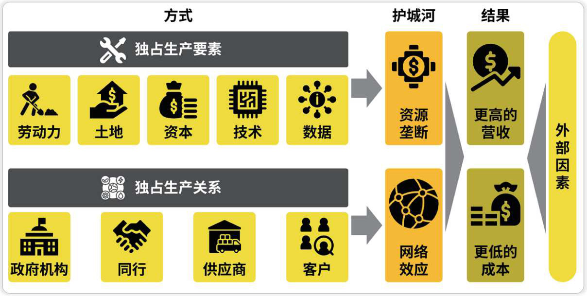

### 盈利性：行业的头部公司能分到多少钱

一个常见的市场结构划分标准是按照 CR8 的高低将行业分为 4 类。

- 分散竞争型：0% < CR8 < 20%
- 低集中竞争型：20% ≤ CR8 < 40%
- 低集中寡占型：40% ≤ CR8 < 70%
- 极高寡占型：70% ≤ CR8 ≤ 100%

---

- 竞争型行业（0%＜ CR8 ＜ 40%）​：企业规模和盈利能力较为接近，市场往往给予其中成长空间较大的企业更高的估值。
- 低集中寡占型行业（40%≤CR8 ＜ 70%）​：龙头企业各有所长，市场通常更看重企业竞争优势的强化，有望实现份额扩张的企业能够享受估值溢价。
- 极高寡占型行业（70%≤CR8≤100%）​：行业进入的壁垒较高，各寡头的市场份额相对稳定，其经营决策又会相互影响，寡头的市盈率估值倍数差异一般不会太大。

行业集中度会受到外部因素的影响，比如经济、政策等因素。

- 行业集中度与宏观经济呈反向变动关系。
- 行业集中度也会受到特定政策的影响。

一般来说，行业集中度随产业生命周期的演变先降后升。

不同行业的集中度天花板不尽相同。

要判断行业集中度的天花板，我们可以参考成熟市场的经验（欧美日韩等）。

---

库存周期：

- 主动补库存：厂商对未来需求的预期很乐观，主动加大备货力度。
- 被动补库存：需求增速放缓，产品卖不动，出现了积压。
- 主动去库存：需求进一步萎缩，厂商主动打折甩卖、清理库存。
- 被动去库存：需求逐渐恢复，但产量没有跟上，存货逐渐减少。

---

- 在行业出现“稳定市场周期化”情况后，影响其盈利性的是行业的竞争格局，竞争格局可以分别从横向格局和纵向格局分析。
  横向格局：研究的是同行间是怎么分蛋糕的。
  纵向格局：研究的是上下游是怎么分蛋糕的。
- 横向格局
  关键指标是行业集中度：随着行业集中度的提高，龙头企业的议价权增强，相应的盈利能力也会提升。
  行业集中度与外部因素（如经济、政策等）有关，也与行业自身属性（如行业所处周期、行业自身的天花板等）有关；出现“稳定市场周期化”情况后，则主要与产能周期有关。
- 产能是指厂商在现有的条件下能够实现的最大产量，产能利用率被用来反映有多少产能得到了实际利用，它的计算公式为产能利用率=实际产量 ÷ 最大产能。
- 产能周期包括“供不应求–产能激增–产能出清–格局改善”4 个阶段。
- 我们可以通过分析来判断是否到了行业底部或行业顶部。
- 行业底部：通常出现在龙头减产、本赛道玩家不玩了、卖方分析师也不推荐的时候。
- 行业顶部：往往出现在龙头扩产、行业外玩家疯狂涌入、卖方分析师给出跳空式评价上调的时候。
- 不过凡事总有例外：一是我们要结合行业的发展阶段（产业生命周期）考虑，二是龙头企业可能会不按常理出牌（比如龙头企业逆势扩张，或主动打价格战）​。
- 纵向格局
  产业链是指各个产业部门基于技术和经济层面的内在联系，形成的链条式的上下游结构。产业链分析是行业研究的基础。
  影响利润分配的主要因素是议价意愿和议价能力。
- 议价意愿：取决于两个要素——商品或服务在下游的价值占比，以及行业所处的周期阶段。
- 议价能力：主要看各个环节的行业集中度以及供需情况。
  我们可以通过产业链各个环节的毛利率以及各个环节占用上下游资金的能力来判断行业在产业链中的地位。

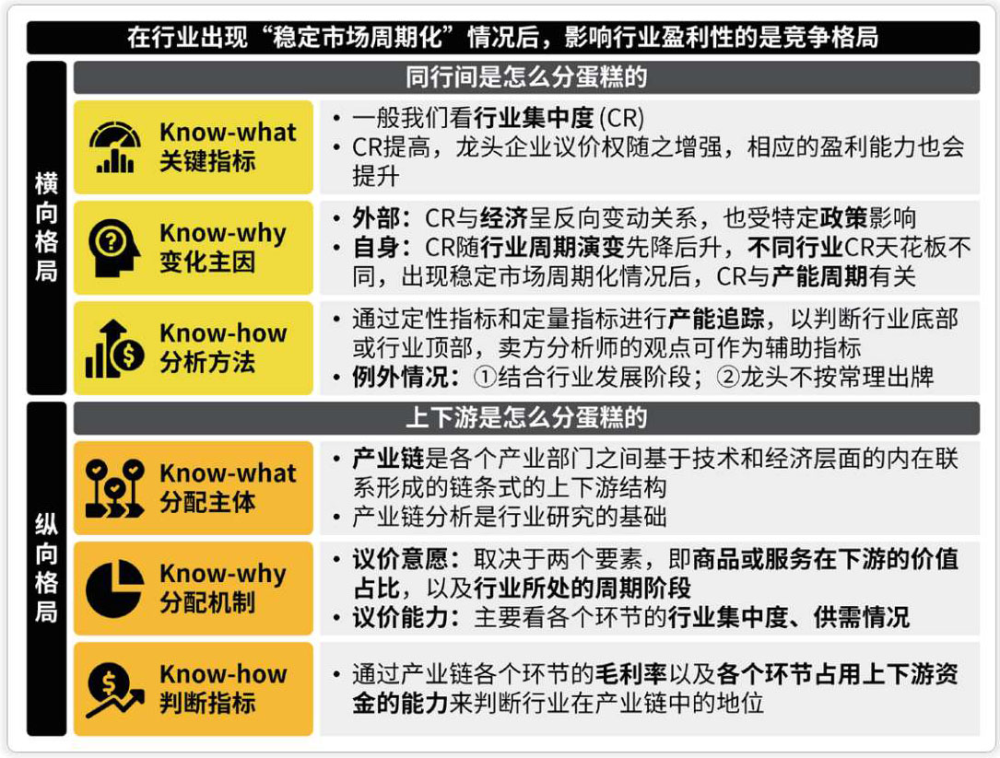

### 估值：行业不同阶段的估值特征

赔率和概率的 4 个维度：

- 可行性：判断的是行业的商业模式存活下来的概率。
- 规模性：判断的是行业的市场规模的天花板，这是在评估赔率。
- 防守性：判断的是行业的护城河能否避免过快进入衰退期的概率。
- 盈利性：判断的是行业的竞争格局是否向好、盈利能否有进一步改善的空间，这也是在评估赔率。

---

- 无论是从美股历史来看还是从 A 股历史来看，只要投资期限没有达到夸张的几十年之久，估值变化就会对收益率产生重大影响。
- 估值是由投资者和资产共同决定的。
  **投资者角度**：重点关注能力（钱多不多）和意愿（风险偏好）​。前者受宏观经济情况（货币政策）影响较大。
  **资产角度**：重点关注赔率（规模性和盈利性）和概率（可行性和防守性）​。
- 在产业生命周期的不同阶段有不同的估值特征。
  **导入期**：投资者更看重行业潜在的成长空间，估值围绕着“梦想”和“故事”展开。
  **成长前期**：业绩高速增长，持续超预期，估值随之快速提升，但存在交易拥挤的风险。
  **成长后期**：业绩增速放缓，高估值已难以为继。
  **成熟期**：渗透率增速不断放缓，行业面临估值收缩的局面。不过，有些行业龙头的估值会随着竞争格局的改善得以提升，这种现象被称为“龙头进阶”​。
  **衰退期**：有些行业中的企业能够开辟第二增长曲线，这类似于企业进入一个新行业；有些行业能够实现稳定市场周期化，估值中枢可以参考成熟市场的情况；而有些行业面临替代品的挑战，利润率往往会大幅下降，估值总体呈不断下跌的趋势。但是如果供给收缩的速度比需求收缩的速度快，可能会出现拔高估值的“回光返照”​。

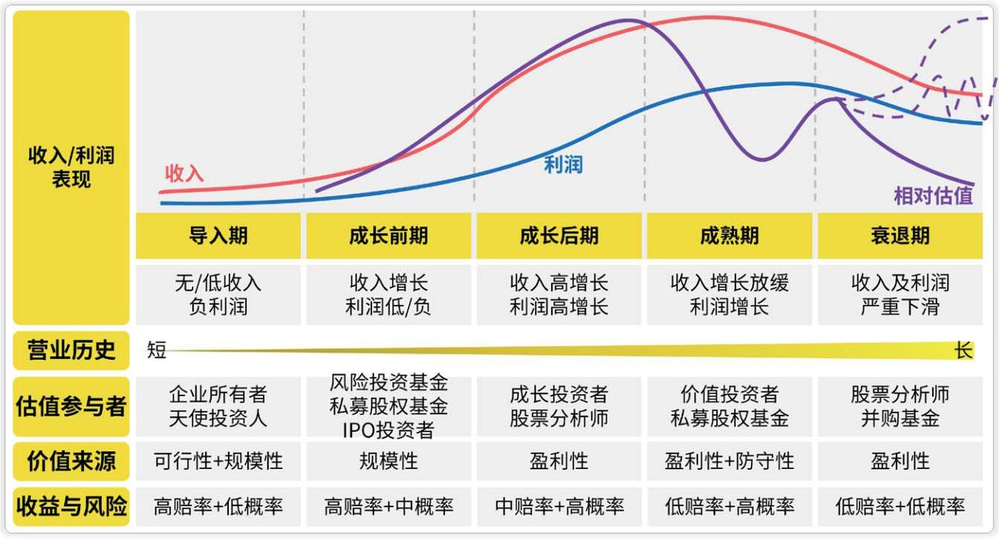

### 外部因素：引爆行业还缺哪根导火线

- 政治、经济、社会文化以及技术这四大外部因素的变化会影响行业的基本面和估值。
- 在政治因素层面，行业分析需要考虑来自国内外的监管。
  在国内政治方面，最不容忽视的是产业政策。
  按照倾向性，产业政策可以分为扶持性产业政策（包括口头鼓励、补贴减税、直接投资、强制使用等）和限制性产业政策（包括限制准入、限制供给、限制价格、限制受众等）​。
  在国际政治方面，对我国市场冲击较大的，是美国的货币政策和美国的外交政策。
- 在经济因素层面，行业分析需要考虑经济发展指标和货币价格。
  在经济发展指标方面，绝大部分行业的盈利都会受到经济周期的影响。此外，经济发展水平会影响产业结构和需求。
  在货币价格方面，货币通过其 3 种价格（货币购买力、利率、汇率）的变化影响各行各业。
- 在社会文化层面，我们主要考虑的因素有人口统计学特征（人口、年龄构成、性别等）以及文化变迁（文化理念、受教育程度、品牌营销策略等）​。前者可视为先天因素，后者则是后天通过社会化过程或灌输形成的。
- 在技术层面，技术创新对行业发展起着重要的推动作用，在分析时我们需要考虑技术成熟度。

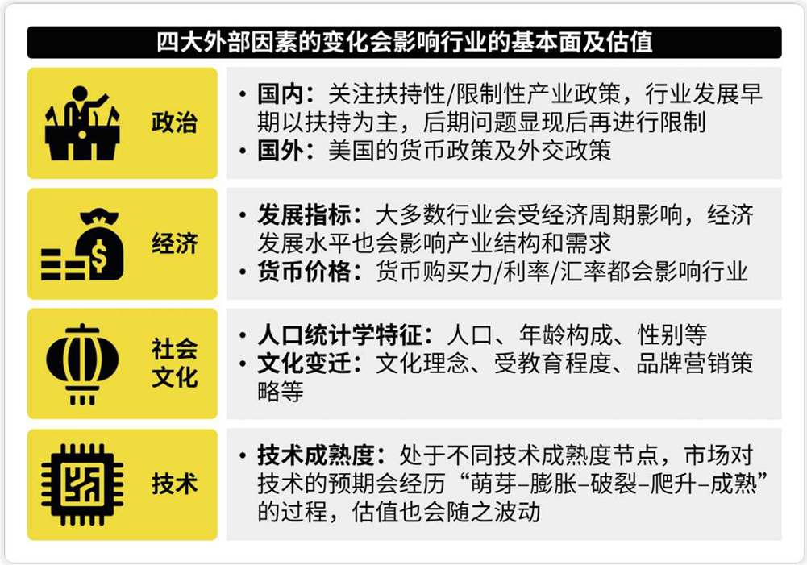

### 景气度：如何预判业绩增速

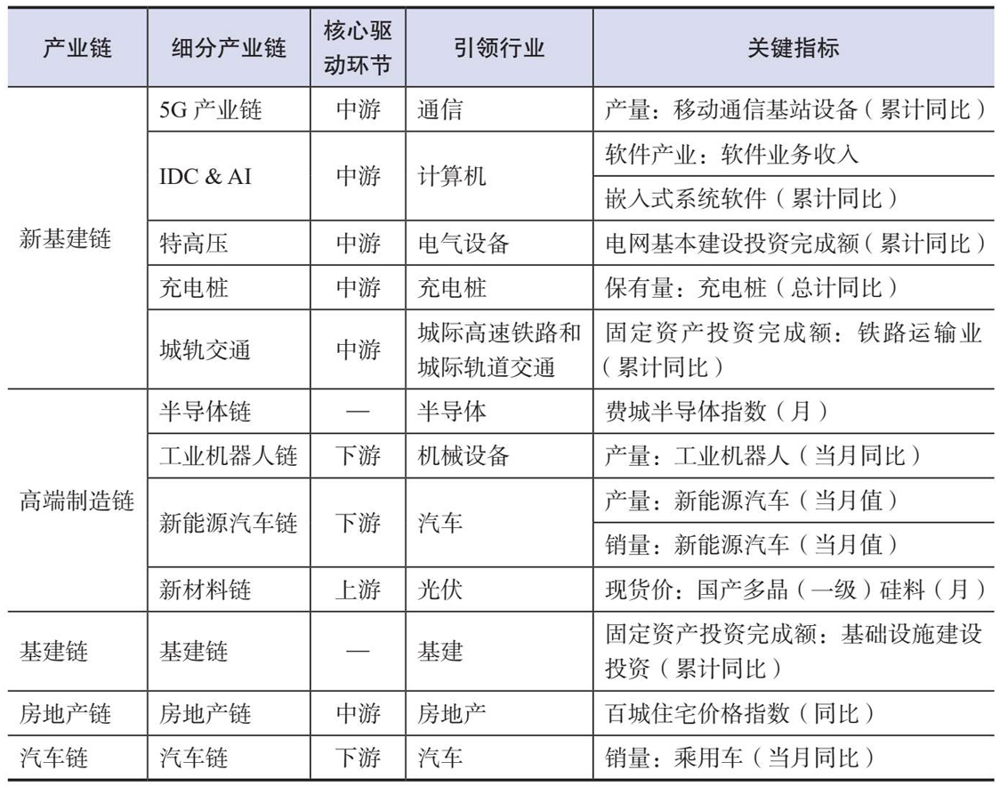

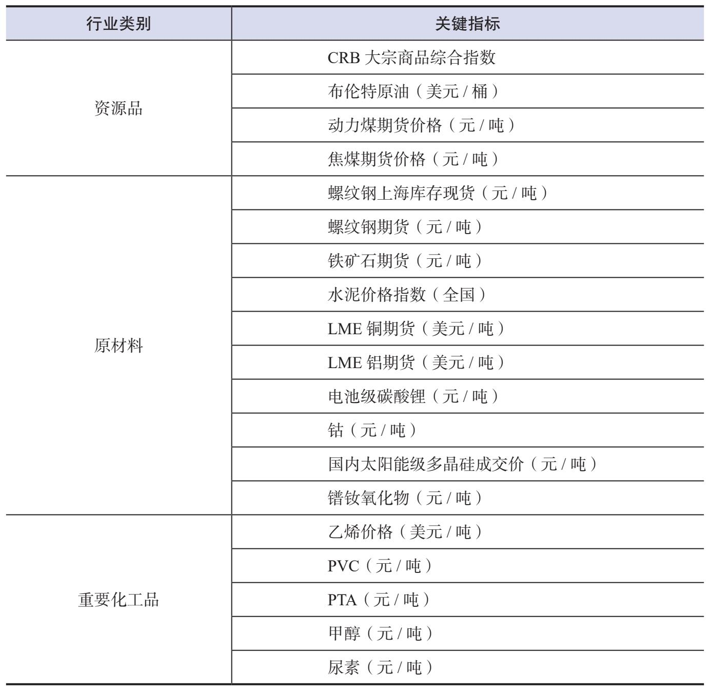

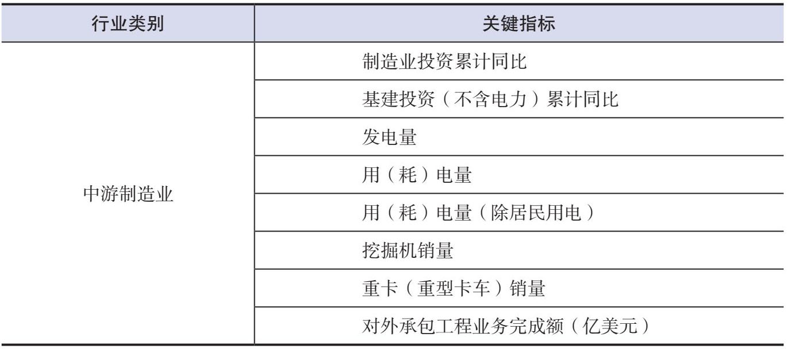

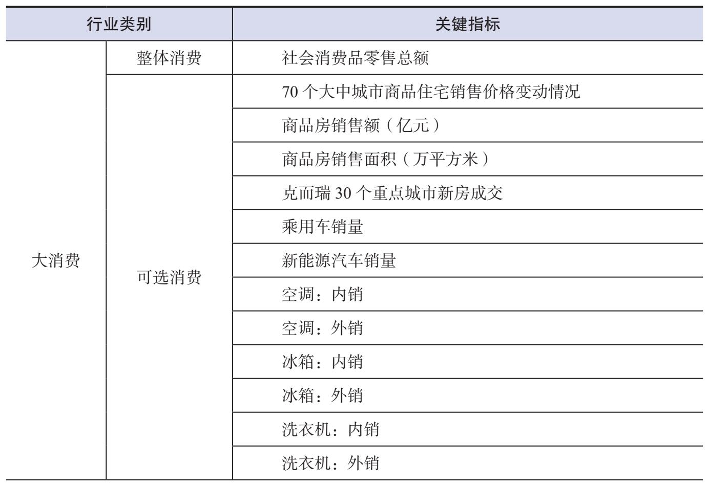

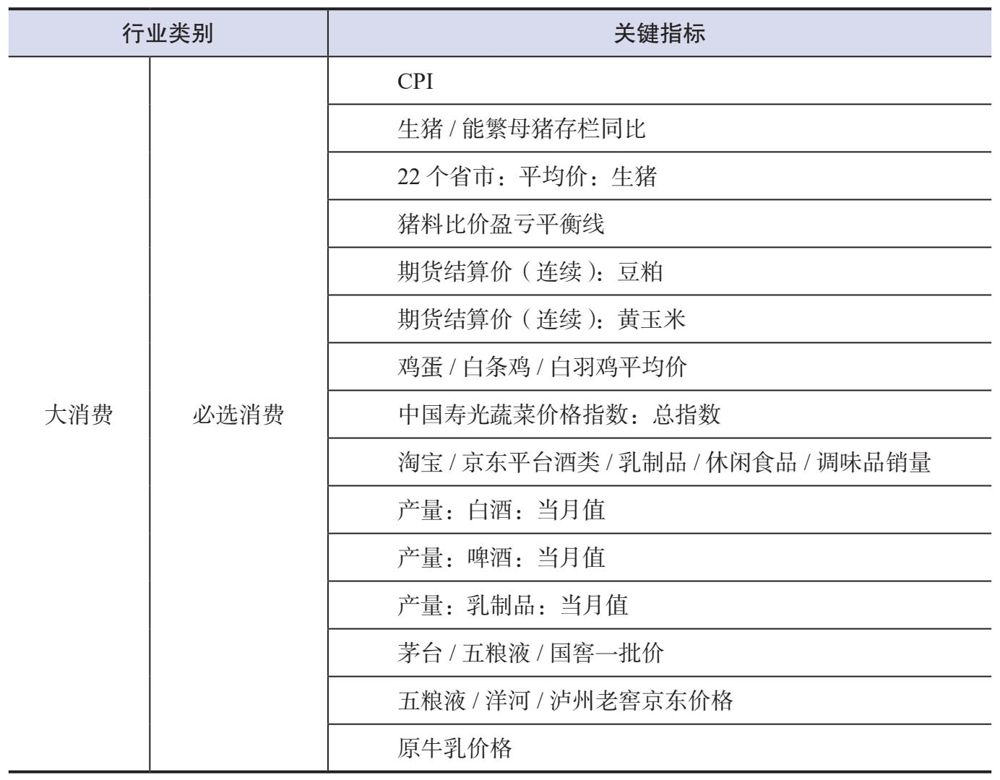

- 跟踪景气度指标可以帮助我们先于报表提前预判行业和公司业绩的走向。景气度指标需要满足两个条件。
  一是它们要能够反映行业的基本面，帮助我们判断业绩情况。
  二是它们的更新频次要足够高，可以按月、周甚至日更新。
- 确认行业景气度的方法有两种。
  通过产业链上下游把握景气度：可以通过产业链中的核心驱动环节来推测整条产业链的景气度。
  通过行业关键指标把握景气度：上游主要看价格和库存；中游制造业主要看产销量；在大消费中，必选消费主要看通胀，可选消费主要看房地产业；电力及公用事业、交通运输、金融等服务业主要看宏观经济；而 TMT 等新兴行业主要看自身的产业周期。
- 研究时不能刻舟求剑，还是要关注景气度指标背后的逻辑。

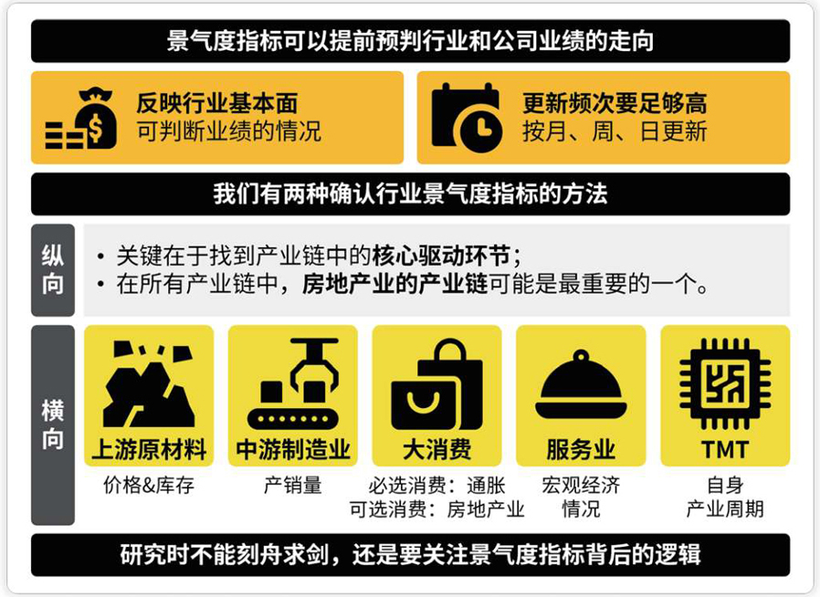
