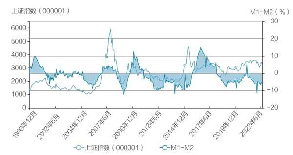
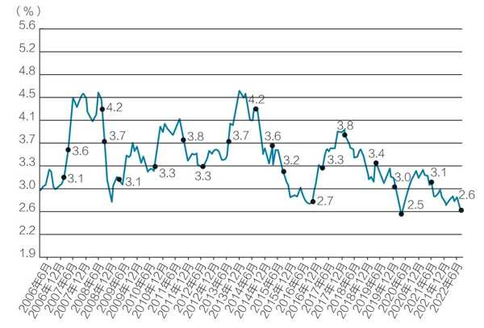
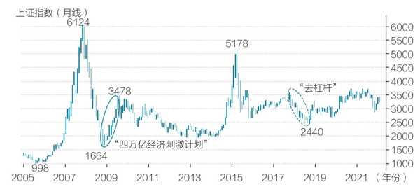
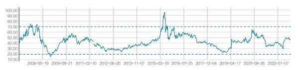

# 周期判断

## 从五个维度判断大盘周期

——《不亏》第二章 一些并不显而易见的常识-周期

### 1.流动性

◆ 我通过对大盘和个股的相关性进行统计分析发现，2018 年以前，虽然大盘和个股在涨跌幅度上相差很大，但在周期上，个股和大盘同涨同跌，相关度高达 95%！也就是说，大盘涨，95%的股票涨；大盘跌，95%的股票跌。2018 年后，机构抱团加剧，把一个个板块打得很高，如白酒板块、医药板块、生猪养殖板块、芯片板块、新能源板块等，行业板块的权重大大增加。集思录网友“ylxwyj”对 2016—2021 年钢铁行业个股的影响因子进行定量分析，发现其与大盘的相关性为 62%，与钢材价格的相关性为 27%。基于这些新的变化，我们对大盘、行业和个股的相关性进行调整，可以得到**个股涨跌公式**：

**个股涨跌 = 大盘 × 60% + 行业 × 30% + 个股 × 10%**

**投资者搞懂了大盘周期和行业景气度，就做好了 90%的功课。** 如果把投资比作登山，大盘周期就是天气，行业景气度就是路况，个股就是登山者。虽然强壮的登山者可能会无视天气和路况，强势登顶，但这样的人能有几个？我们更愿意把宝押在晴朗的天气和正确的道路上，在这样的条件下，即便是平庸的登山者也能爬得很高。

◆ 对于大盘的判断，我们也总结了一个**大盘涨跌公式**：

**大盘涨跌 = a1 × 流动性 + a2 × 估值 + a3 × 业绩展望 + a4 × 市场情绪 + a5 × 重大事件**

通常地，大盘的涨跌要综合考虑**资金流动性、市场整体估值、业绩展望、市场情绪和重大事件**五方面因素，各因素的权重系数根据不同的时间进行动态调配。其中，**资金流动性是影响大盘涨跌的最重要的力量**；市场整体估值是机构进行大类资产轮动时的重要参考数据，其统计数值在判断大底和大顶时比较准确；将大盘笼统划分为若干个板块，判断各个板块的业绩展望，可以综合得出大盘的整体多空力量；市场情绪则用于观察和判断资金的意图和动态，在择时过程中很重要；重大事件没有发生时，对大盘涨跌的权重为 0，一旦发生，短时间内对大盘涨跌起到决定性和唯一性的作用，如俄乌战争、新冠疫情这样的事件。

◆ 最后是**用技术分析验证对大盘走势的判断**。价值派可能不相信技术分析，但我们并不排斥技术分析。我们认为，股市里的所有方法，都有其适用场合和适用时机，都是有价值的。对大盘有了自己的判断后，再用技术分析来验证，非常有效。
对大盘走势的判断，肯定做不到一步到位，而是**“预判—出现偏差—分析新变量—调整判断”持续迭代的过程**，随着对大盘的底、顶和运行方向的判断逐渐准确，最终我们能够实现**“躲过系统性风险，抓住系统性机会”**。

◆ **资金流动性是大盘走势最重要的驱动力**。简单地说，市场上的钱多了，股市就涨；钱少了，股市就跌。判断大盘走势，首先要考察流动性。
衡量流动性的标准指标，是 **M1 同比增速-M2 同比增速（简称“M1-M2”）**。其中，M1 是狭义货币，即现金+活期存款；M2 是广义货币，即 M1+定期存款+证券保证金等。如果 M1 增速大于 M2 增速，意味着活期存款增速大于定期存款增速，企业和居民交易活跃，流动性增强；反之，如果 M1 增速小于 M2 增速，表明企业和居民选择将资金以定期的形式存入银行，流动性减弱。M1-M2 与上证指数的对比如图 2-11 所示。

不难看出，大部分时间 M1-M2 走势与上证指数走势都有极为明显的正相关性。从 1999 年 12 月至 2022 年 6 月，去掉几个极端情况，M1-M2 的剪刀差在-15%～ 15%波动。**当剪刀差向下波动，达到-8%时，表明股市离底不远；而当其向上波动，超过 8%之后，表明股市离顶不远。**

◆ 在实际应用中，M1-M2 不太直观，我们一般用**市场无风险收益率来衡量流动性**，如 10 年期国债收益率、银行理财收益率等。以 10 年期国债收益率为例（见图 2-12），其收益率大体在 2.5%～ 4.5%波动，**收益率低于 2.8%时表明流动性充裕，收益率高于 3.8%时表明流动性紧缩**。

甚至，我们可以更粗放一点，纯粹从定性的角度来评估流动性，**货币政策宽松就是流动性宽裕**，如 2008 年的“四万亿经济刺激计划”；**货币政策紧缩就是流动性紧缩**，如 2018 年的“去杠杆”（见图 2-13）。之所以采用定性的方法，是因为**定性比定量重要**，即知道未来是宽松还是紧缩比较重要，这已经决定了未来大盘的运行方向了，至于宽松到什么程度或紧缩到什么程度，相对来说没有那么重要。

◆ 小盘股的估值仍然呈现宽幅震荡，**中小综指的市盈率波动范围是 20 ～ 70 倍，中位数是 45 倍左右**（见图 2-15）。于是，我们可以用中小盘的估值来评估市场水位。大体上，**中小盘的市盈率跌到 30 倍以下，可以认为市场被低估；涨到 60 倍以上，可以认为市场被高估**。

◆ 我们将估值应用于对大盘的判断，其核心价值是，**当估值出现极值时，可以预见大盘即将出现逆转**，这个统计规律是非常有价值的。举例来说，2016 年初，恒生指数的估值已经达到 2008 年的低点，后续向上的概率比向下的概率大得多，具备极佳的风险收益比，其后一年恒生指数涨了 70%。2022 年 9 月，恒生指数跌破了 2016 年的低点，后市如何，我们拭目以待。

◆ 我们主张**对市场情绪进行主观的、模糊的处理**，即市场情绪就是投资者本人感受到的情绪，模糊地判断这段时间是冷还是暖即可。
**情绪暖**，就是任何消息都算利好，市场热点此起彼伏，热点持续时间长，市场成交量大，游资到处出没。
**情绪冷**，就是任何消息都算利空，市场热点持续时间短，涨一个板资金就着急兑现，市场成交量低迷，游资好长时间也不折腾一下。
另外，**游资是市场中最敏锐的资金**，跟踪游资动态，可以较准确地捕捉到市场情绪的转换。比如游资经常活跃在可转债、ST 股票、北交所等小市值板块，在大盘持续下跌后，如果游资突然在某个板块发动，那么大盘有很大的可能性会止跌企稳一段时间，这在做超跌反弹时是非常有效的策略。

◆ **重大事件都是突发的、难以预测的**，绝大部分投资者都来不及反应。但是在大事发生以后，投资者可以预判事件的发展变化，从而获利，这个策略叫作 **“事件驱动”**。本书会有专门的章节介绍这个策略。**事件驱动考验的是投资者在哲学、社会、经济、管理者价值观等方面的深刻理解和认知。**
2020 年 4—5 月，新冠疫情在全球暴发，全球股市暴跌。就在 5 月海外疫情最恐慌的时刻，我（资水）重仓了德国 30 QDII（513030），大赚了一笔。这是因为我信奉一个哲学理念——**“人定胜天”**，即每次碰上天灾人祸，组织起来的人类是世界上压倒一切的、最伟大的力量，我相信疫情被克服只是时间问题。
本节，我们介绍了职业投资人判断大盘周期时考虑的五个维度，实际上，判断大盘周期是一项实践活动，需要投资者自己去尝试和体会，得出自己的判断。如同游泳一样，虽然别人讲了游泳的手部动作、腿部动作和呼吸换气，但我们仍需要在水里操练很久，才能学会游泳。
