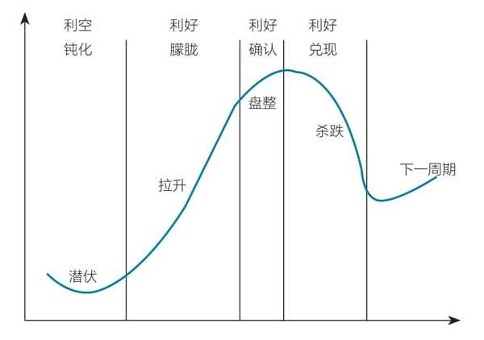

# A 股市场

## A 股市场的生态

——《不亏》第二章 一些并不显而易见的常识-A 股的生态

◆ **个股也是如此，持续定增、配股的企业相当于给自己打上了“挣假钱”的标签，大股东和管理层持续减持的企业相当于给自己打上了“我很贵”的标签，这些个股的后续市场表现通常都不太好。**
反过来，在指数或股票的低位，如果产业资本持续增持，则行情大概率见底。**特别是股东或管理者个人增持，表示对企业的强烈看好，股票反转的概率很大。**

◆ 这其实是**行业制度的问题**，即基金公司的利润来源是管理费，在市场情绪高涨的时候有发行新基金、扩大规模的强烈冲动，形成“持仓涨—申购多—发新基—买自己的持仓股—持仓更涨”的循环，蕴含的风险是很大的，**所以基金公司的利益与基民的利益是不同的。**
基金行业已经认识到这个问题。2022 年 6 月，中国证券投资基金业协会发布《基金管理公司绩效考核与薪酬管理指引》，要求基金管理人拿出 30%的薪酬买本公司基金，并优先买本人管理的基金。该指引能不能得到落实，能不能实现基金公司与基民利益的统一，还有待观察。

◆ **股票型公募基金都有最低持仓要求**，2015 年“股灾”之前的最低持仓线是 60%，2015 年后变为 80%。**偏股型基金平均仓位的统计数据，是观察市场情绪的理想指标。** 基金平均仓位高，表示市场情绪乐观，行情往往见顶：该买的都买了，谁来把行情再买上去呢？基金平均仓位低，表示市场情绪悲观，往往是建仓良机：该卖的都卖了，还有谁能卖出呢？
所以，**机构很高明，但是其考核薪酬机制让机构往往很不高明。** 公募基金的抱团行为和平均仓位都是市场上的明牌，是可以被投资者观察到和利用到的指标。**所以，战胜机构，是投资者完全可以实现的目标。**

◆ **游资是 A 股市场最活跃、最愿意承担风险的力量**，一般出没在题材股、小市值股、摘帽股、可转债等短时间内涨跌幅很大的领域。**观察游资的动态是了解市场的必修课**，可以帮助投资者更加敏锐地对行情作出判断。**A 股是非常适合游资生存的。** 以打板为例，首板可能需要 5000 万元资金，第二板可能只需要 3000 万元资金，第三板可能只需要 2000 万元资金。于是游资只需要筹集 1 亿元资金就可以将一只股票拉升 30%，然后慢慢地出货，最后可能取得 10%的收益。以前的“涨停板敢死队”可能就是这种模式，代表人物徐翔的资产曾达到 200 多亿元。

◆ A 股被称作散户型市场，散户占 A 股总流通市值的 36.1%。但是散户在 A 股的占比是逐渐减少的。据海通证券统计，2015—2021 年第四季度，散户占流通市值的比例从 53.9%降至 36.1%。未来，A 股会不会跟某些国外市场一样，变成机构型市场呢？
**我们的结论是不会。** **散户存在的根本原因是高波动率，** 短期致富的神话能够吸引大批个人投资者参与其中。如前文所述，因为对冲机制不完善，A 股正好是一个高波动率的市场，给个人投资者提供了丰富的土壤。一部分人追热点题材趋势，一部分人做重组重整，短期内涨幅巨大，这样的财富效应会吸引众多的投资者。

◆ **投资是一件终身学习、成长的事情**，从别人的分享中汲取营养是重要的学习手段。别人的思想和作业可以借鉴，但不能完全抄袭，不能缺乏困而知之的环节，一定要思而知之，结合自己的实践体会，摸索出适合自己的可行的方法。对于大 V 和粉丝的第二种关系，正确的姿势就是虚心学习，不可盲听盲从，并不是大 V 本身观点有问题，而是我们不熟悉他的体系，只是盲人摸象。

◆ 查理·芒格曾说：**“投资并不简单，认为投资简单的人都是傻瓜。”** 想以简单模式就做好投资的人可能也是傻瓜。所以听消息或跟大 V 都需要保持正确的姿势，求同存异、兼收并蓄。

## A 股的行为模式是炒预期

——《不亏》第二章 一些并不显而易见的常识-A 股的行为模式是炒预期

### A 股和其他市场行为模式的区别

以长安汽车（SZ000625）为例，2022 年 7 月 14 日发布业绩预增公告，预增 189%～ 258%。但实际上长安汽车的股价在 5 月初至 6 月底的短短 2 个月涨到 3 倍多，已经把业绩预增的利好提前兑现了，预增公告发布以后，股价反而不再表现（见图 2-22）。

**这就是 A 股和其他市场行为模式的区别， A 股根据预期甚至是想象空间进行交易，其他市场根据确切的信息进行交易。**

◆ **为什么 A 股的行为模式是炒预期？** 我们认为有两个原因：一是 A 股有涨跌停板，又缺乏个股做空机制，个股做错风险低，培养了 A 股投资者更愿意承担风险的意识；二是 A 股有庞大的散户群体，民间投资论坛火热，几乎对所有个股都能做到无缝覆盖，能把个股的利好提前几个月就发掘出来。

### 把握预期差

◆ **炒预期的行为模式，形成了 A 股的炒作周期（见图 2-23）：**

第一，**潜伏阶段**。股票对利空钝化，已经拒绝下跌，尽管还没有利好的消息，但有先知先觉的资金已经入场潜伏。
第二，**拉升阶段**。出现利好的传闻，从朦胧的小道消息到各大 V 开始讨论，股票热度上升，股价大幅拉升。
第三，**盘整阶段**。机构调研报告或者公司预告确认有利好，股价反而不再大涨，而是高位盘整，敏感资金开始兑现，散户接盘。
第四，**杀跌阶段**。公司发利好公告，利好兑现，散户还在抱着良好期望，但盘面上抛盘汹涌，股价大跌。
这个行为模式，我们只能去适应它。在建仓的时候，我们要比大众更早地预判到利好，甚至要比机构投资者更早地预判到利好；在出货的时候，一旦利好兑现，且后面没有更大的利好，就要立即出货。**这就是在 A 股操作的一条基本原则：永远要比别人预期在前面。** 有一个词语专门描述这条原则，叫 **“预期差”**。

◆ 例如，2022 年 4—5 月，上海因新冠疫情封城，预计解封的时间是 6 月，上海的企业复工复产也应该在 6 月，这是一个确定性事件。但是**上海本地股的反弹，却在“五一”节假日前两天就开始了，比复工复产时间早了整整一个月**。我（资水）抓住了这个机会，在 4 月 29 日买进了一大堆上海本地股，在一个月之内取得了 20%的收益。

## 不同市场奖励不同的投资风格，根源是产业结构和资本回报特征的差异

**不同市场奖励不同的投资风格，根源是产业结构和资本回报特征的差异。** 美国奖励成长（高ROE+全球化公司+正向现金流循环），欧洲奖励价值（成熟工业企业+奢侈品+稳定现金流），香港奖励动量（离岸市场资金追求更高的短期回报），A股奖励产业趋势——而产业趋势的本质是"谁在持续大规模地掏钱"。房地产时代居民是掏钱方，新能源时代政府是掏钱方，AI硬件时代海外云厂商和国内互联网平台是掏钱方。

## 从宏观Beta到产业Alpha：中国资产的角色转换

谢妍提出了一个关键的结构性问题：中国资产在全球资配中，是否正在从一个"配置型Beta"（买了放着享受经济增长）变成一个"交易型Alpha"（需要精挑细选、挖掘产业间超额收益）？

恽雷的回应展现出对产业结构变迁的深刻理解。过去10-20年中国资产的最大Beta是城镇化——居民买房、房产增值、促进消费，白酒、家电、家居都是房地产的衍生品。2021年之后，地产、人口、消费和监管环境的变化让这一套Beta逻辑变弱。

但新的Beta正在形成。AI硬件领域的中国公司，不是在AI时代才设立的，而是在过去十到十五年制造业转型和独立可控的过程中持续积累能力，"当AI产业链起来之后，接住了这个泼天的富贵"。独立可控的Beta是中国独有的，而AI硬件的Beta是几乎所有东南亚国家都能分享的。

更重要的是外资投资结构的变迁。十年前外资配中国买的是消费——"老外经历过城市化进程，知道房价涨了之后居民会消费更多，这些东西他们能理解"。现在外资配的是中国独有制造业体系——继电器、断路器、变压器、高尔夫球车、全地形车、摩托车、新能源车等资本品走向全球。"与其关心外资在中国市场的净流入规模，不如关心外资投资标的的结构变化。"恽雷举了一个生动的例子：在日本唐吉诃德总部门口放着巨大的泡泡玛特拉布布，在欧洲看到中国的摩托车产业链，在美国看到中国制造的高尔夫球车——中国公司正在从"服务中国内需"变为"输出全球制造能力"，这相当于当年丰田汽车从日本走向全球的路径。

**中国资产正从宏观Beta转向产业Alpha。** 过去外资配中国买的是城镇化+消费升级的宏观Beta，现在买的是中国独有的制造业体系——从"服务中国内需"走向"输出全球制造能力"。比起关心外资的净流入规模，更应该关注其投资结构的变迁：从白酒、消费、互联网，转向本地替代、资本品出口和全球化制造业公司。

中国公司从"服务中国内需"转向"输出全球制造能力"——摩托车在欧洲、新能源车在全球、全地形车和高尔夫球车在美国、工业器件（继电器、断路器、变压器）在全球。这个Beta与传统的消费升级Beta完全不同，也与AI硬件Beta不同。它更像当年丰田汽车从日本走向全球的路径：靠过硬质量、极致性价比和快速迭代。边界：贸易战和地缘政治可能限制这一Beta的空间。

## 全要素生产率的提高就是中国经济发展的保障

[全要素生产率的提高就是中国经济发展的保障（2026.07.08 单伟建）](https://mp.weixin.qq.com/s/4C-4N_RhDuaYjjchVVUVIg)

**全文主旨**

- **投资环境与增长奇迹**：以深圳机场的现代化和深发展银行投资获15倍回报为例，表明深圳乃至中国凭借改革开放营造了高回报、高增长的投资环境。
- **“中等收入，超现代性”悖论**：中国仍是人均GDP约1.3万美元的中等收入国家，但在高铁、电动车、基础设施及关键技术领域已领先诸多发达国家。
- **科技中心条件齐备**：中国已同时具备顶尖人才、研究机构、资本、深度制造能力和庞大统一市场五大要素，成为与美国并列的全球科技中心，从而解释了上述悖论。
- **全要素生产率是根本保障**：劳动力人口下降后经济仍翻番，PWT修正数据显示2009年后中国全要素生产率年均增长超2%，科技驱动的生产率提升才是未来发展的核心保障。

**核心洞见**

- **机场代际优势**：深圳宝安机场的先进程度和客运量已超越香港，新旧基础设施对比折射出后发优势。
- **15倍回报的深圳速度**：深发展银行五年资产翻四倍，出售获利22亿美元，今日规模更达8000亿美元，浓缩了深圳爆发式增长潜力。
- **购买力平价超越**：按购买力计算中国GDP已超美国30%，国内物价与服务质量的反差意味着人民币实际购买力强劲且存在升值空间。
- **中等收入下的超现代性**：人均GDP排名70余位，却拥有五万公里高铁、超高压电网等发达国家不具备的基础设施和产业规模。
- **关键技术主导权反转**：澳大利亚战略政策学院报告显示，64项关键科技中中国已领先57项，美国仅剩7项。
- **科技中心五要素拼图**：人才、机构、资本、制造、大市场，过去仅美国具备，如今中国是唯一全部齐备的国家。
- **实物劳动生产率碾压**：以实物计，中国制造业劳动生产率平均是美国的两到三倍。
- **TFP增长重估**：权威数据库PWT修正，2009-2019年中国全要素生产率年均提升2.3%，同期美国无增长，打破“效率停滞”论。

**隐含推理**

- **可复制的投资模板**：统一大市场使深圳验证的商业模式能迅速向全国扩张，规模效应是超额回报的放大器。
- **香港枢纽地位相对弱化**：基础设施和客流被反超，预示着香港作为区域核心门户的功能面临被替代的压力。
- **人民币长期被低估**：巨大的购买力落差暗示名义汇率远未反映真实价值，升值趋势构成资产定价的底层逻辑。
- **西方效率评估存在系统性偏差**：PWT大幅上修中国全要素生产率，说明此前“中国效率衰退”的共识很可能源于方法论缺陷。
- **增长引擎已完成历史性切换**：劳动人口下降而经济总量翻番，证明增长已彻底摆脱对人口数量的依赖，内嵌于效率提升。
- **全球智力逆流**：中国能为顶尖人才提供比成熟市场更大的阶层跃迁空间，加速科研人力资本的回流与集聚。
- **资本内生性独立**：超40%的储蓄率意味内部资金足以支撑创新，降低对国际资本波动的敏感度。
- **名义发展水平失真**：超现代性体验与中等收入标签并存，暗示人均GDP等传统指标可能显著低估中国的实际发展程度和生活质量。
