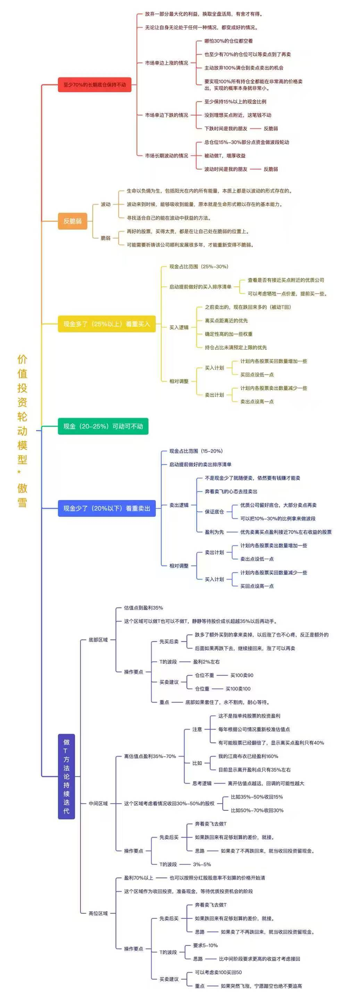

<StockPool />

## 操作指南

## 至少 70% 的长期底仓保持不动

- 放弃一部分最大的利益，换取全局适应，有舍才有得。
- 无论让自身无论处于任何一种情况，都变成好的情况。
- 市场单边上涨的情况
  - 哪怕 30% 的仓位都空着
  - 也至少有 70% 的仓位可以享受点到了再卖
  - 主动放弃 100% 满仓到卖点卖出的机会
  - 要实现 100% 所有持仓全部都能在非常高的价格卖出，实现的概率本身就非常小
- 市场单边下跌的情况
  - 至少保持 15% 以上的现金比例
  - 没到理想买点附近，这笔钱不动
  - 下跌时间是我的朋友——反脆弱
- 市场长期波动的情况
  - 总仓位 15%~30% 部分点资金做波段轮动
  - 被动做 T，增厚收益
  - 波动时间是我的朋友——反脆弱

## 反脆弱

### 波动

- 生命以负熵为生，包括阳光在内的所有能量，本质上都是以波动的形式存在的。
- 波动来到时候，能够吸收到能量，原本就能主动形式确认存在的基本能力。
- 寻找适合自己的能在波动中获益的方法。

### 脆弱

- 再好的股票，买得太贵，都是在让自己处在脆弱的位置上。
- 可能需要折腾该公司盈利发展很多年，才能重新变得不脆弱。

## 现金多了（25% 以上）：着重买入

- 现金占比范围：25%~30%
- 启动提前做好的买入排序清单
  - 着重是否有接近买点附近的优质公司
  - 可以等着跌一点价差，提前买一些
- 买入逻辑
  - 之前卖出的，现在跌回来的（被动 T 回）
  - 离买点距离近的优先
  - 确定性高的加一些权重
  - 持仓占比未满预定上限的优先
- 相对调整
  - 买入计划
    - 计划内各股票买回数量增加一些
    - 买回点设低一点
  - 卖出计划
    - 计划内各股票卖出数量减少一些
    - 卖出点设高一点

## 现金（20%~25%）：可动可不动

## 现金少了（20% 以下）：着重卖出

- 现金占比范围：15%~20%
- 启动提前做好的卖出排序清单
- 卖出逻辑
  - 不是现金少了就随便卖，依然要有钱赚才能卖
  - 奔着变飞的心态去挂卖出
  - 保证底仓
    - 优质公司留好底仓，大部分卖点再卖
    - 可以把 10%~30% 的比例拿来做波段
  - 盈利为先
    - 优先卖离买点盈利接近 70% 左右仓位的股票
- 相对调整
  - 卖出计划
    - 计划内各股票卖出数量增加一些
    - 卖出点设低一点
  - 买入计划
    - 计划内各股票买回数量减少一些
    - 买回点设高一点

## 做 T 方法论持续迭代

### 底部区域

- 估值点到盈利 35%
- 这个区域可以做 T，也可以不做 T，静静等待股价成长超过 35% 以后再动手。
- 操作要点
  - 先卖后买
    - 跌多了额外买到的拿来卖掉，以后涨了也不心疼，反正是额外的
    - 后面如果再跌下去，继续接回来，涨了可以再卖
  - T 的波段
    - 盈利 2% 左右
  - 买卖建议
    - 仓位不重：买 100 卖 90
    - 仓位重：买 100 卖 100
  - 重点
    - 底部如果套住了，永不割肉，耐心等待

### 中间区域

- 离估值点盈利 35%~70%
- 注意
  - 这不是简单地股票的投资盈利
  - 每年根据公司情况重新校准估值点
  - 有可能股票已经翻倍了，显示离买点盈利只有 40%
- 比如
  - 我的江南布衣已经盈利 160%
  - 目前显示离开盈利点只有 35% 左右
- 思考逻辑
  - 离开估值点越远，回调的可能性越大
- 这个区域考虑看情况收回 30%~50% 的股权
  - 比如 35%~50% 收回 15%
  - 比如 50%~70% 收回 30%
- 操作要点
  - 先卖后买
    - 奔着变飞去做 T
    - 如果卖回来有足够划算的差价，就接
    - 如果卖了不再跌回来，就当收回投资留现金
  - T 的波段：3%~5%

### 高位区域

- 盈利 70% 以上
  - 也可以按照分红股息率不划算的价格开始清
- 这个区域作为收回投资、准备现金、等待优质投资机会的阶段
- 操作要点
  - 先卖后买
    - 奔着变飞去做 T
    - 如果卖回来有足够划算的差价，就接
    - 如果卖了不再跌回来，就当收回投资留现金
  - T 的波段
    - 要求 5%~10%
    - 比中间阶段要求更高的收益才考虑接回
  - 买卖建议
    - 可以考虑卖 100 买回 50
  - 重点
    - 如果突然飞涨，宁愿踏空也绝不要追高



[持仓组合透视盈余计算法：稳定心神、抵抗股价波动的工具](https://mp.weixin.qq.com/s/eKbpWEE4V1k-7ryC0mfZVw)

- 傲雪：现金不多，进平庸区就可以开始逐渐换一些现金了。经济还没真实恢复，以后还会有机会的。始终留一部分仓位到险地区再退出，这部分做好一直不退的考虑。
- 傲雪：我是考虑平时围绕20%左右现金来（问现金比例大概多少比较好）。
- 傲雪：做T呗。大部分仓位不动。
- 傲雪：涨了卖一些，跌了买一些。一次涨上去就退出一波。一次跌多了就低价多收集点。持续上串下跳就拿一部分来回做T。这样搭建反脆弱系统，让涨跌都有利于自己。
- 傲雪：探索适合这个世界的操作原则。
- 傲雪：也可以跟老巴一样低价买入之后长期不动。都等更贵了再回收投资。
- 傲雪：嗯，一定要奔着卖飞去做T。有这个心态，就不怕。
- 邵庆晓：前十大70%左右。其实无论基金还是个人，15个 ~ 20个股够了。越多股陪跑，越累。耐心可能是最好的办。

## 波动降本

[实战：鹿鼎公之波动降本-做T神火股份（2025.08.29 一叠纪）](https://mp.weixin.qq.com/s/qE42yopnRf-Zfoi37eLBHg)

[鹿鼎公：如何判断红利低波指数的底，低到什么程度（2026.06.21 鹿鼎公）](https://mp.weixin.qq.com/s/JgWgEOv8HiRqLZaLzTIAjw)

[鹿鼎公：建仓紫金矿业以及后续买入卖出点（2026.03.16 鹿鼎公）](https://mp.weixin.qq.com/s/e24-woE0o9eHQ-N9BS8HPg)

[鹿鼎公（2026.08.10）：增减仓猜测（2026.08.11 一叠纪 29.32 卖出10000股的在 27.67 接回来，大概占总仓位2%）](https://mp.weixin.qq.com/s/21DNzG0Nn5snl6jtfiCbmQ)

### 一、核心前提：必须选对股

::: tip 🧱 做 T 的基础是“道”，选股是根本。

- **标的必须低估**：只有持有 <Badge type="tip" text="非常好" /> 且 <Badge type="tip" text="非常低估" /> 的股票，才拥有做 T 的安全垫。
- **不懂不做**：若无法准确判断行业和企业的价值，做 T 是空谈。唯有在价值认知上完胜市场，做 T 才能锦上添花。
  :::

### 二、根据估值阶段，严守三大铁律

将股价分为 **三个阶段**，不同阶段策略截然不同，这是做 T 的精髓。

| **阶段**                                    | **估值状态**     | **核心策略** | **操作纪律**                                                                                                                                                  |
| :------------------------------------------ | :--------------- | :----------- | :------------------------------------------------------------------------------------------------------------------------------------------------------------ |
| <Badge type="tip" text="A. 低估阶段" />     | 股价远低于价值   | **先买后卖** | 技术低位进场（如日线低位，30 分钟、60 分钟 MACD 低位/KDJ 底部打滚），**套住绝不割肉**，不盈利不卖。**只卖出加仓部分，底仓不动。**                             |
| <Badge type="warning" text="B. 合理阶段" /> | 股价大致反映价值 | **先卖后买** | 遇连续大阳线先卖出，**价差必须大**（如：不跌回卖出价的 97%以下绝不接回）。买回数量等于卖出数量。若 T 飞，坦然接受，**绝不追高**。                             |
| <Badge type="danger" text="C. 高估阶段" />  | 股价高于价值     | **只卖少买** | 遇连续大阳线卖出，设定更大幅度的价差才考虑接回（如：跌回 90%以下）。**关键在于：接回数量必须小于卖出数量的一半**，分批兑现利润。若 T 飞，果断放弃，绝不追回。 |

::: info ℹ️ 阶段划分说明

- **低估阶段**：你有安全边际，能扛得住错误，因此敢于“先买后卖”，套住也不怕。
- **合理阶段**：股价基本到位，此时主要目的是锁定利润并等待下一个低估机会，所以“先卖后买”，价差拉大。
- **高估阶段**：鱼尾行情，风险收益比极差，必须主动减仓，宁可不做也不追高。

:::

### 三、仓位与纪律：保住底仓，控制风险

::: warning ⚠️ 务必遵守的纪律

- **小仓操作**：用 <Badge type="tip" text="1-2%" /> 的底仓进行做 T，盈利积累，不伤筋动骨。
- **套住不割**：在底部区域，宁可被套也绝不割肉，靠时间取胜，可因此实现 **100% 胜率**。
- **飞了不追**：在中部或顶部区域，如果卖出后股价不跌反涨，**绝不追高买回**，坦然接受 T 飞。
- **大仓位搬砖**：小仓位做 T 赚波动，大仓位可进行“搬砖”（企业成长和修复），即换股到更高性价比的标的上，进一步优化持仓。

:::

### 四、终极认知：做 T 是“术”，而非“道”

::: danger ⚡ 给普通投资者的警告

- **做 T 是职业选手的辅助工具**：它能帮你在长期潜伏中守住筹码、赚取额外收益，但 **无法替代选股能力**。
- **普通投资者慎用**：若无天赋、时间和极强的心理素质，切勿沉迷。  
  👉 **普通投资者的王道是“选股能力”和“仓位控制”**。
- **复利思维**：目标追求每日微利（如千分之一），利用复利效应，长期积累惊人。  
   🧮 `1.001^250 ≈ 128.4%`

:::

> 鹿鼎公：“做 T 不过是术，你拥有了赚钱的王道之后，这种术能帮你多赚一点，帮你打发无聊时间，让你能在一个长长长长的潜伏底里守得住筹码，还能顺便赚一些。选行业、选股都没学会的人，就别看。”

## 实用工具

计算从某个股息率跌到某个股息率需要跌多少

```text
4% → 5%  1/5   20%
5% → 6%  1/6   16.6%
6% → 7%  1/7   14.29%
7% → 8%  1/8   12.5%
8% → 9%  1/9   11.11%

4% → 6%  2/6   33.3%
4% → 7%  3/7   42.85%

5% → 7%  2/7   28.6%
```
